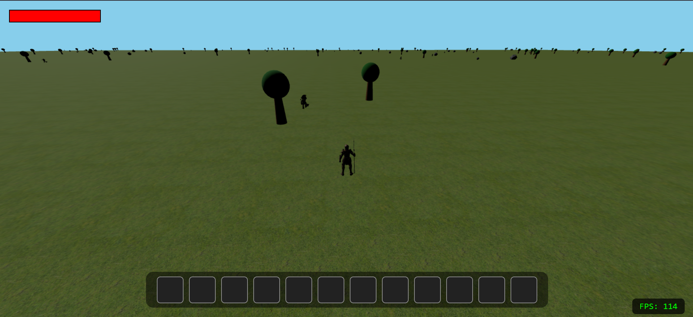

# WoW-TS

A simple 3D game inspired by World of Warcraft movement and camera, built with Three.js and TypeScript.

## Features

- WoW-style player movement (WASD, diagonals, camera rotation with right mouse button)
- Randomly spawned zombie enemies, each with an independent instance
- Obstacles (trees, rocks) and health bars above enemies
- Attack system and health management
- 3D rendering with shadows and textured terrain

## Screenshot



## Getting Started

1. Install dependencies:
   ```bash
   npm install
   ```
2. Start the project:
   ```bash
   npm run dev
   ```
3. Open your browser at `http://localhost:5173`

## Notes

- The file `screenshot1.png` is located in the `static/` folder.
- To add more screenshots, place them in the same folder and update the README.
