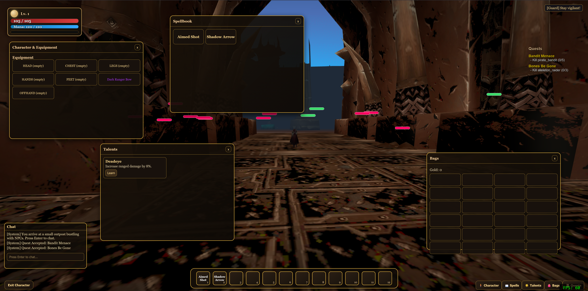
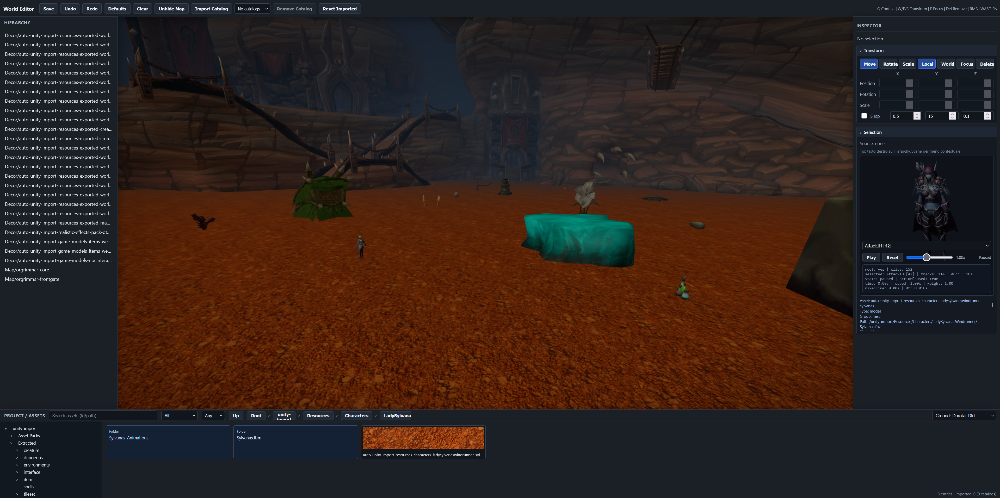

# WoW-TS

Sandbox RPG in `Three.js + TypeScript` con:
- modalità **Play** (combattimento, UI RPG, quest, chat, classi/spell)
- modalità **World Editor** in stile Unity-like (Hierarchy/Inspector/Project)
- pipeline asset Unity importati + cataloghi esterni da URL/CDN

## Screenshot
### Play Mode


### Editor Mode


## Requisiti
- Node.js `24.9.0`
- npm `11.6.1`

## Avvio Rapido
```bash
npm install
npm run dev
```

Apri `http://localhost:5173`.

Build e preview:
```bash
npm run build
npm run preview
```

## Modalità Play
### Cosa include
- Login + selezione personaggio
- Classi e spell di base con spellbar 12 slot
- Combat loop con target, HP/mana/xp UI, floating combat text
- Quest tracker e finestre Character/Spellbook/Talents/Bags
- Spawn runtime di creature/gameobject da comando
- Volo (`.fly on`) con gestione animazioni airborne/swimming quando disponibili

### Controlli Play
- Movimento: `W/S` avanti-indietro, `A/D` rotazione
- Salto: `Space`
- Cast spellbar: `1..0`, `-`, click sugli slot
- Fly mode: `Space` su, `X` giù
- UI hotkeys: `B` Bags, `C` Character, `P` Spellbook, `N` Talents
- Chat: `Enter`
- Pause: `Esc`

## Modalità Editor
### Attivazione
Da chat:
- `.editor on`
- `.editor off`

Alias:
- `.worldeditor ...` (stessi subcomandi di `.editor`)

### Layout editor
- Top bar: save/undo/redo/defaults/clear/import catalog
- Sinistra: **Hierarchy**
- Centro: viewport scena
- Destra: **Inspector** (transform + preview asset)
- Basso: **Project / Assets** con struttura cartelle + breadcrumb

### Controlli Editor
- `W / E / R`: Move / Rotate / Scale gizmo mode
- `F`: focus selezione
- `Del`: delete selection (o hide map object se selezione map)
- `Q`: context menu rapido
- `RMB + WASD`: fly camera editor

### Browser asset (Project)
- Search per id/path
- Filtri categoria (`All`, `Placeable`, `Model`, `Animation`, `Texture`, `Audio`, `Material`, `Exported`, `Extracted`, `Game`, `Tilesets`, `Asset Packs`, `Effects Pack`, `Manual`, `Auto`, `WMO`, `World`, `Maps`, `Creature`, `Item`, `Spell`)
- Filtro formato (`Any`, `OBJ`, `FBX`, `GLB`, `GLTF`)
- Doppio click su asset placeable: piazza in scena
- Drag & drop da browser a scena: piazza in world
- Context menu per azioni specifiche per tipo asset

### Inspector preview
- Immagini/texture: preview immagine
- Audio: player inline
- Modelli/animazioni (`fbx/glb/gltf/obj`): viewer 3D con
  - dropdown clip animazioni
  - `Play/Pause`
  - `Reset`
  - slider velocità
  - debug stato animazione (clip/tracks/time/mixer)
  - rotazione con drag
  - pan con `Ctrl + drag` (centrare a mano il modello)
  - zoom disabilitato volutamente

## Comandi Chat (completi)
I comandi iniziano con `.`

- `.editscale <positive number>`
  - Scala la creatura selezionata.

- `.spawncreature <TEMPLATE_ID> [friendly]`
  - Spawna una creatura volatile alla posizione player.
  - `friendly` opzionale la rende non ostile.

- `.spawngameobject <TEMPLATE_ID>`
  - Spawna un gameobject volatile alla posizione player.

- `.gm on | off`
  - Attiva/disattiva GM mode.

- `.fly on | off`
  - Attiva/disattiva volo player.

- `.movehere`
  - Muove il target selezionato sulla posizione player.

- `.daynight on | off`
  - Attiva/disattiva ciclo giorno/notte.

- `.hasscript`
  - Mostra script associato alla creatura selezionata.

- `.showcollisionrays on | off`
  - Abilita/disabilita debug collision rays.

- `.collisionrays on | off`
  - Alias di `.showcollisionrays`.

- `.editor help`
  - Mostra help sintetico editor.

- `.editor on`
  - Entra in editor mode.

- `.editor off`
  - Esce da editor mode.

- `.editor list [query]`
  - Lista decor id disponibili (filtrabile).

- `.editor place <decorId>`
  - Piazza decor davanti camera editor.

- `.editor clear`
  - Rimuove tutte le decor piazzate in sessione.

- `.editor save`
  - Salva placements decor su localStorage.

- `.editor reload`
  - Ricarica placements decor.

- `.editor defaults`
  - Ripristina decor di default.

- `.worldeditor ...`
  - Alias completo di `.editor ...`.

## Catalogo Asset e Import da host esterni
Il runtime mergea asset da:
- configurazione manuale (`src/world/unity-decor.config.ts`)
- generati da scanner locale (`unity-import`)
- cataloghi esterni importati da JSON e salvati in localStorage

Storage key cataloghi esterni:
- `wowts.unity_decor_catalog.external.v1`

Toolbar editor:
- `Import Catalog`
- `Remove Catalog` (con dropdown key catalogo)
- `Reset Imported`

In editor mode le notifiche operazione sono via `alert` (chat nascosta).

### Standard JSON catalogo (`wowts.decor-catalog.v1`)
Formato consigliato:

```json
{
  "version": "wowts.decor-catalog.v1",
  "baseUrl": "https://cdn.example.com/game-assets/",
  "assets": [
    {
      "id": "orc-banner-01",
      "url": "models/orc/banner_01.glb",
      "preview": "previews/orc/banner_01.png"
    }
  ]
}
```

Regole:
- `id` e `url` sono obbligatori per ogni asset.
- Alias URL supportati: `path`, `model`, `resource`.
- `baseUrl` risolve URL relativi.
- Supportati URL assoluti e path root-relative.
- Legacy `{ decorations: [...] }` compatibile.
- `catalogKey` deve essere univoca all’import.

## Pipeline Asset Unity
Script utili:
```bash
node tools/generate-unity-exported-decor.mjs
node tools/generate-unity-import-index.mjs
```

Output principali:
- `src/world/unity-exported-decor.generated.ts`
- `src/world/unity-import-index.generated.ts`

Note:
- Scanner esteso a contenuti in `public/unity-import/**`
- Mapping automatico FBX animazioni quando trova pattern `<ModelName>_Animations/*.fbx`

## Persistenza Locale
Nessun backend/DB: solo `localStorage`:
- salvataggi decor editor
- cataloghi importati
- dati runtime necessari al gioco

## File chiave
- `src/game.ts`
- `src/ui.ts`
- `src/editor/world-editor.panel.ts`
- `src/chat/commands/index.ts`
- `src/chat/commands/worldEditor.ts`
- `src/world/unity-decor-catalog.ts`
- `src/world/unity-decor.config.ts`
- `src/world/unity-exported-decor.generated.ts`
- `src/world/unity-import-index.generated.ts`
- `src/utils/animationCatalog.ts`
